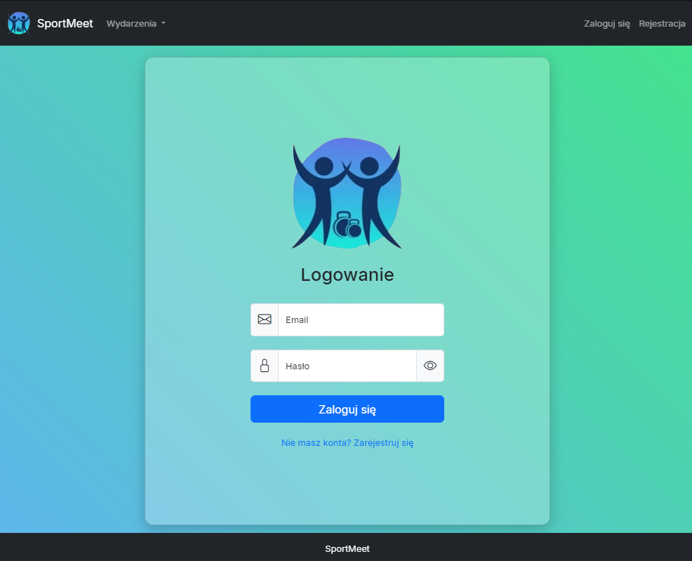
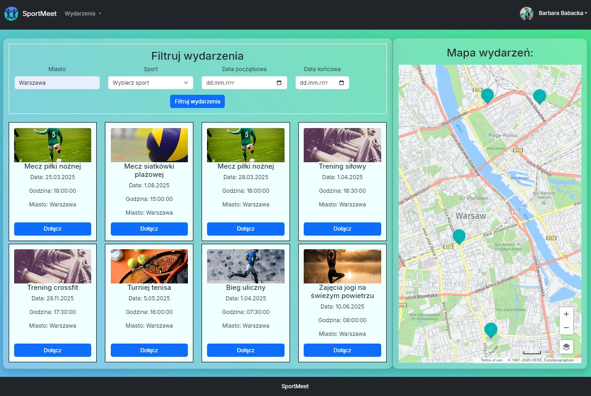
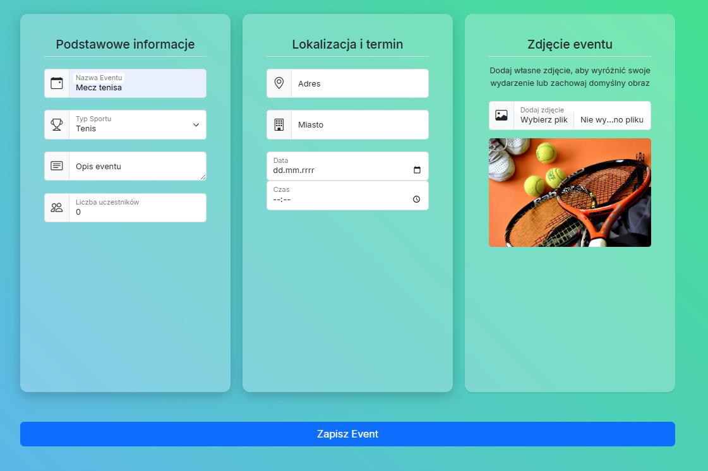
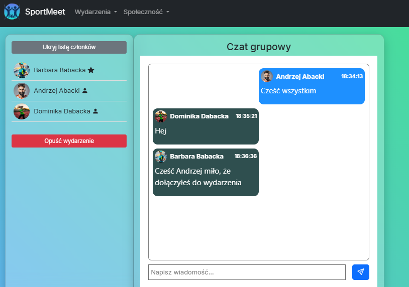
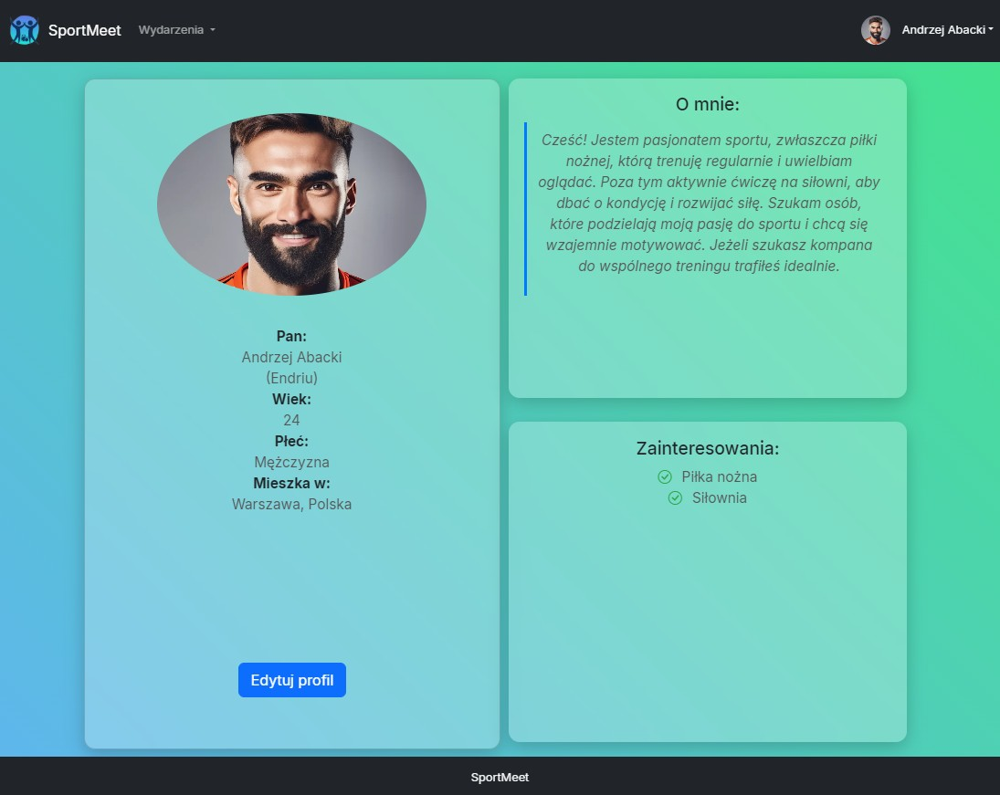

# SportMeet

Platforma dla społeczności sportowej – umawianie się na wspólne treningi i aktywności z wykorzystaniem technologii .NET oraz Vue.js  

---
##  Technologie i narzędzia

###  Backend
-  **.NET 8 (ASP.NET Core)**
-  **Entity Framework Core** +  **PostgreSQL**
-  **SignalR** – komunikacja w czasie rzeczywistym
-  **Swagger** – dokumentacja API
-  **Cloudinary** – przechowywanie zdjęć
-  **AutoMapper**, **BCrypt.Net**, **JWT Authentication**

###  Frontend
-  **Vue 3** +  **Vite**
-  **Pinia** – zarządzanie stanem
-  **Vue Router**
-  **Axios** – komunikacja z API
-  **Bootstrap 5** +  **Bootstrap Icons**
-  **Vue Toastification** – powiadomienia
-  **HERE Maps API** – mapa i lokalizacje
---

## Widoki aplikacji

| Rejestracja i logowanie | Opis |
|-------------------------|------|
|  | Aplikacja umożliwia użytkownikom tworzenie kont oraz logowanie.<br/><br/>Proces rejestracji uwzględnia walidację danych (np. poprawność adresu e-mail, długość i zgodność haseł).<br/><br/>Po poprawnym zalogowaniu użytkownik otrzymuje token **JWT**, który umożliwia dostęp do chronionych zasobów aplikacji. |

| Wyszukiwanie wydarzeń | Opis |
|------------------------------|------|
|  | Dzięki integracji z **HERE API** użytkownik ma możliwość przeszukiwania dostępnych aktywności na dwa sposoby:<br/><br/>**Tekstowo** – panel filtrów, który pozwala na precyzyjne określenie kryteriów wyszukiwania (lokalizacja, rodzaj sportu, zakres dat).<br/><br/>**Wizualnie** – wyszukiwanie za pomocą interaktywnej mapy, przedstawiającej lokalizacje wszystkich dostępnych wydarzeń. |

| Tworzenie i zarządzanie wydarzeniami | Opis |
|----------------------------------|------|
|  | System umożliwia uwierzytelnionym użytkownikom tworzenie własnych wydarzeń sportowych w prosty i intuicyjny sposób.<br/><br/>Twórcy wydarzeń mają pełną kontrolę nad utworzonymi przez nich wydarzeniami<br> i mogą nimi zarządzać (edycja, anulowanie). |

| Czaty i statusy | Opis |
|-----------------------------------|------|
| | System umożliwia komunikację pomiędzy użytkownikami aplikacji poprzez chaty prywatne lub grupoe oraz pokazuje status **online/offline** użytkowników w czasie rzeczywistym dzięki wykorzystaniu **SignalR**. |

| Profil użytkownika | Opis |
|-----------------------------------|------|
|  | Każdy użytkownik posiada profil z danymi i zainteresowaniami.<br/><br/>Użytkownik ma możliwość zarządzania profilem, edycji danych oraz dodania opisu. |

---

##  Architektura

```
SportMeet/
 ├─ backend/
 │   └─ src/
 │      ├─ API/                # Kontrolery, konfiguracja, instalatory, SignalR hubs
 │      ├─ Application/        # DTO, serwisy, interfejsy, AutoMapper
 │      ├─ Domain/             # Encje i interfejsy repozytoriów
 │      └─ Infrastructure/     # DbContext, repozytoria, migracje, serwisy zewnętrzne
 │   
 │
 └─ frontend/
    └─ client/                 # Aplikacja Vue 3 (Vite)
        ├─ src/pages/          # Widoki (Login, Register, Events, Profile itd.)
        ├─ src/components/     # Komponenty UI (Navbar, Chat, Footer)
        ├─ src/services/       # API clients (Axios + JWT)
        ├─ src/stores/         # Pinia stores (auth, user, presence)
        └─ src/utils/          # SignalR helper
 
```

## Autorzy i informacje:

Projekt opracowany samodzielnie w ramach pracy inżynierskiej.
